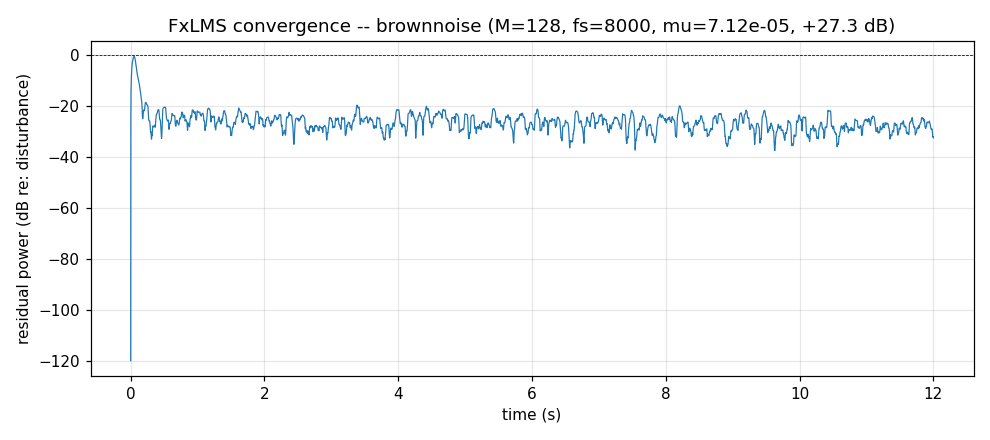
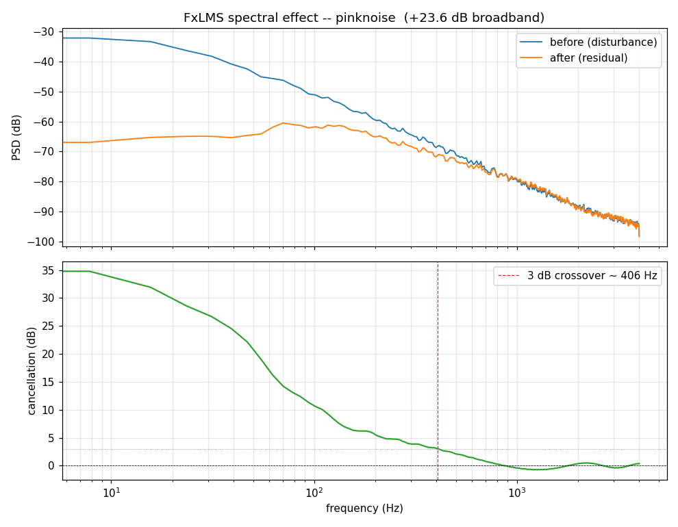
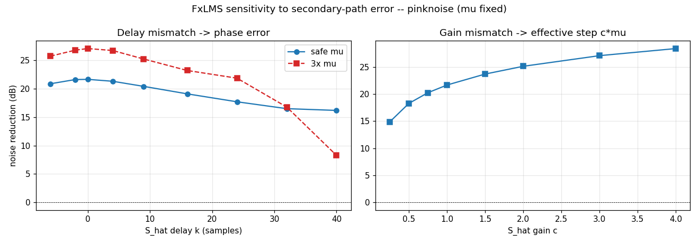
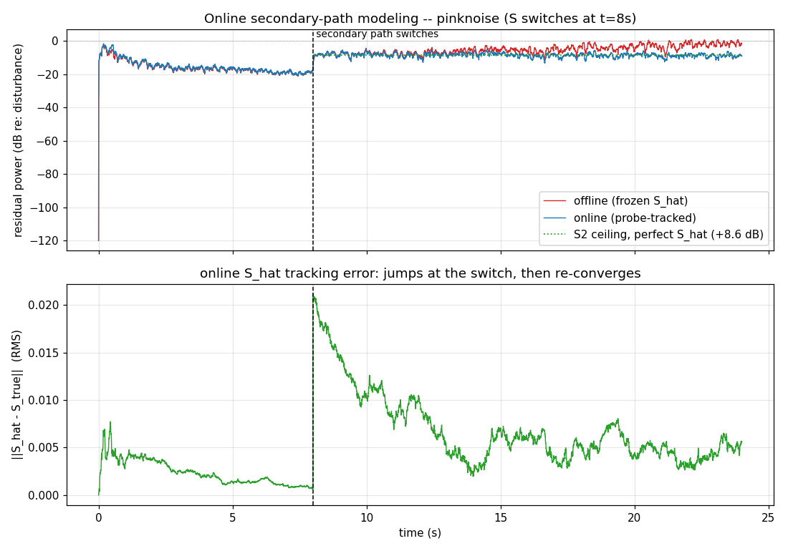

# fxlms-anc

A clean, self-contained **Filtered-x LMS (FxLMS)** active-noise-control implementation in Python, with three runnable experiments that show how it behaves — convergence, spectral effect, and the secondary-path-error failure mode that makes real ANC hard.

No external data required: the experiments **synthesize their own coloured noise**, so every result is reproducible from a clean checkout. You can also point them at a real recording with `--audio`.

> Inspired by [markostam/active-noise-cancellation](https://github.com/markostam/active-noise-cancellation) (a MATLAB/C FxLMS course project). This is an independent Python implementation — the core, path models, noise synthesis, and experiments are original.

## What FxLMS does

Feed-forward ANC: a reference mic hears noise `x`. It reaches your ear through the **primary path** `P` as the disturbance `d = P*x`. A speaker plays anti-noise `y = W·x` that reaches your ear through the **secondary path** `S`. The error mic hears the leftover:

```
e = d − S*y          →  drive e → 0
```

`W` is an adaptive FIR filter. The catch: the control signal passes through `S` before the error mic, which rotates the gradient phase, so plain LMS diverges. The fix is **Filtered-x** — filter the *reference* through an estimate `Ŝ` of the secondary path and use that in the update:

```
x' = Ŝ * x
W += μ · e · x'
```

Everything about how well an ANC system works comes down to how accurate `Ŝ` is.

## Install

```bash
pip install -r requirements.txt
```

## Experiments

```bash
# 1. converge once; render before/after audio + a convergence curve
python experiments/convergence.py --kind brown

# 2. where in the spectrum does it cancel? (it kills the low-frequency drone)
python experiments/spectrum.py --kind brown

# 3. the failure mode: imperfect secondary-path estimate Ŝ
python experiments/secondary_error.py --kind pink

# 4. online secondary-path ID (Eriksson): recover from a path change mid-run
python experiments/online_spm.py --kind pink

# any of them on a real recording instead of synthetic noise:
python experiments/convergence.py --audio path/to/noise.wav
```

Outputs (wavs + PNGs) land in `outputs/`.

### 1 — Convergence

FxLMS drives the residual down over a second or two. On these signals it reaches **15–28 dB** of broadband reduction depending on how predictable the noise is (steady tonal drone cancels best; broadband transients least).



### 2 — Spectral effect

FxLMS removes the **predictable low-frequency** energy and leaves high-frequency hiss essentially untouched — this is exactly why ANC headphones quiet engine and road noise but not speech.



### 3 — Secondary-path error (the hard part)

The update direction comes from the *estimate* `Ŝ`, but the physical world uses the true `S`. Three independent mismatches, with `μ` held fixed:

- **Sign / 180° phase** (`Ŝ = −S`): diverges at any `μ` — the update ascends the gradient. The floor of the ±90° phase-stability rule.
- **Delay / phase error** (`Ŝ = S` shifted): graceful at a safe `μ`, but cliffs hard once the phase error exceeds 90° in the signal's dominant band — and far worse at an aggressive `μ`. Stability margin and `Ŝ`-accuracy margin are the same budget.
- **Gain error** (`Ŝ = c·S`): rescales the effective step to `c·μ`. Underestimate → just slow; overestimate → diverges.



This is what every "adaptive / auto-calibrating" claim in an ANC product is really solving. Real systems either run **online secondary-path identification** (experiment 4) or use **leaky/robust FxLMS** that trades performance for tolerance to `Ŝ` error.

### 4 — Online secondary-path modeling (Eriksson's method)

The experiments above freeze `Ŝ` after one training pass. When the real secondary path *changes* — headphone re-seated, temperature drift — a frozen `Ŝ` has the wrong phase and cancellation collapses. Eriksson's fix: inject a low-level uncorrelated white **probe** into the speaker and run a *second* concurrent LMS that re-identifies `Ŝ` from the probe while the controller keeps cancelling.

Here the true secondary path **switches at t = 8 s**. Offline (frozen `Ŝ`) collapses; online re-tracks `Ŝ` and recovers everything the new path physically allows:

| after the switch | reduction |
|---|---|
| offline (frozen `Ŝ`) | +1.6 dB |
| online (probe-tracked) | +8.8 dB |
| ceiling (perfect `Ŝ`) | +8.6 dB |

The online curve hugs the green ceiling — it extracts the maximum the new path permits, while the frozen estimate sits far below it. The bottom panel shows `Ŝ` tracking error jump at the switch, then re-converge. (The ceiling is only +8.6 dB because a change drastic enough to break a frozen estimate is, by the same phase physics, a longer-delay path that is inherently harder to cancel — see experiment 3.)



## Layout

```
fxlms_anc/core.py          FxLMS loop, secondary-path ID, path models, noise synthesis
experiments/convergence.py before/after audio + convergence curve
experiments/spectrum.py    PSD before/after + per-band cancellation
experiments/secondary_error.py  Ŝ-mismatch sweeps (sign / delay / gain)
experiments/online_spm.py  Eriksson online secondary-path ID through a path change
```

## Limitations

This is a teaching/simulation repo — faithful to the FxLMS algorithm and its failure modes, but not a hardware-validated controller. Specifically:

- **Modeled acoustic paths, not measured.** `P` and `S` are short decaying-FIR approximations (`default_paths`), not impulse responses captured from a real enclosure. Real paths are longer, non-minimum-phase, and vary with temperature, fit, and head movement.
- **Feed-forward only.** Real ANC earbuds use a **hybrid** topology (feed-forward reference mic + feedback error mic in the ear). The feedback path adds its own stability constraints this repo doesn't model.
- **Offline secondary-path ID by default.** Experiments 1–3 learn `Ŝ` once up front from a clean white-noise pass. Experiment 4 adds **online** identification (Eriksson's probe-injection method) to track `S` as it drifts — but at a fixed step and probe level, without the variable-step or auxiliary-noise-power scheduling that production systems use to minimize the probe's own residual.
- **Fixed step size.** A single tuned `μ`, not the normalized/variable-step or leaky variants (FxNLMS, leaky FxLMS) that real systems use for robustness to `Ŝ` error and non-stationary noise.
- **No fixed-point / latency budget.** Float64, block-convolution, no per-sample compute or group-delay constraints. On real hardware the controller must run inside one sample period, and the secondary-path delay sets a hard ceiling on achievable cancellation.
- **Stationary, full-band reference.** The reference is assumed clean and perfectly correlated with the disturbance. Real reference mics pick up wind, the user's own voice, and uncorrelated noise that no feed-forward controller can cancel.

The experiments are designed to show *why* these things matter — `secondary_error.py` in particular demonstrates the `Ŝ`-accuracy problem that drives most of the above.

## License

MIT — see [LICENSE](LICENSE).
